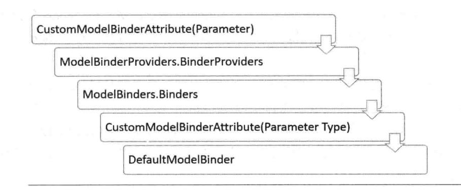

# 《asp.net mvc5 框架揭秘》
## chapter 1 asp.net+mvc
* 关注点分离（soc），界面呈现、UI逻辑、业务逻辑的分离
* 模式可以直接应用，范例只是提供指导方针
* httpmodule的意义在于通过注册httpapplication的事件，将所需操作注册到http请求的处理流程
* 集成模式和经典模式区别？
    经典模式是通过isapi将request发送到asp.net管道，iis和asp.net是独立的
    集成模式是asp.net注册的httpmodule和httphandler是绑定在iis宿主中，解决了iis和asp.net重复验证和静态资源asp.net无法处理的问题
* asp.net管道
    appdomainfactory->isapiruntime->isapiworkerrequest->httruntime->httpcontext->httpapplication->httpmodule->httphandler
* httpapplication 通过PostResolveRequestCache事件中context.RemapHandler实现自定义handler处理。
***C#
        protected virtual void OnPostResolveRequestCache(object sender, EventArgs e)
        {
            HttpContextWrapper httpContext = new HttpContextWrapper(HttpContext.Current);
            RouteData routeData = RouteTable.Routes.GetRouteData(httpContext);
            if (null == routeData)
            {
                return;
            }
            RequestContext requestContext = new RequestContext
            {
                RouteData = routeData,
                HttpContext = httpContext
            };
            IHttpHandler handler = routeData.RouteHandler.GetHttpHandler(requestContext);
            httpContext.RemapHandler(handler);
        }
***
 * mvc处理流程

## chapter 2 route
* RouteTable.Routes 在system.web.dll中，所以路由是跟asp.net绑定在一起的
* routetable.routes是对于整个应用的全局变量，通过getreadlock getwritelock来保证线程安全
* 路由注册支持的constraint，1.正则 2.IRouteConstraint ps:HttpMethodConstraint 
* RouteTable.Routes.RouteExistingFiles=True,RouteExistingFiles 是否对物理文件映射
* 全局RouteExistingFiles和route实例的RouteExistingFiles，映射结果不一致 S206
* 建议配置 全局RouteExistingFiles=true，对于不需要路由的文件添加ignore
* area 的注册和生成，AreaRegistration
* UrlHelper & HtmlHelper生成url，通过指定的routename生成特定的url，生成方法主要还是依赖于GetVirtualPath

## chapter3 controller激活
* IController ControllerBase IControllerAsync 异步controller
* ControllerFactory ReleaseController释放
* ControllerBuilder 不同命名空间下同名的controller必须指定命名空间的优先级，否则会抛出异常
* Controller 解析，
* Controller 缓存，同AreaRegistration一样，缓存是xml持久化的，重启mvc缓存依旧有效
* 会话状态的控制，SessionStateBehavior,ISessionState,SessionStateAttribute

## chapter4 model元数据的解析
* modelmetadata表示model的层次结构，modelmetadata和Ilist<modelmetadata>的组成了model的层次结构
* IMetadataAware 实现了对model元数据的定制
* 三种模板 1.UIHint指定预定义模板 2.数据类型模板，只能匹配基础数据模板 3.自定义模板，根据模板名称匹配
* 模板的获取和执行，顺序templatename,templatehtin,datatypename,datatype
* cachemodelmetadata annoucemodelmetadata

## chapter5 3个描述对象
* descriptor 是对controller,action,parameter的横向拓展，辅助类
* ICustomAttributeProvider 提供获取自定义属性接口
* controllerDescriptor > reflectedcontrollerdescriptor & reflectedasyccontrollerdescriptor
* actiondescriptor parameterdescriptor

## chapter6 model的绑定（一）
* model的绑定是指 action被执行之前，parameter的提取和生成
* IValueProvider ValueProviderResult 
* 通过前缀获取参数名，复杂类型的层级结构为树形，ValueProvider为key-value结构，如何key-value映射为tree?  
通过key的层次结构,[paramname/index].parameter.property
* FormValueProvider,QueryStringValueProvider 继承 NameValueCollectionValueProvider
* 
* IModelBinder 实现action中参数的绑定,五种默认实现的modelbinder,binary,postedfile
* modelbinderprovider中的modelbinder具有更高的优先级
* 
* 
* ParameterDescriptor 存储action参数信息

## chapter7 model绑定（二）
